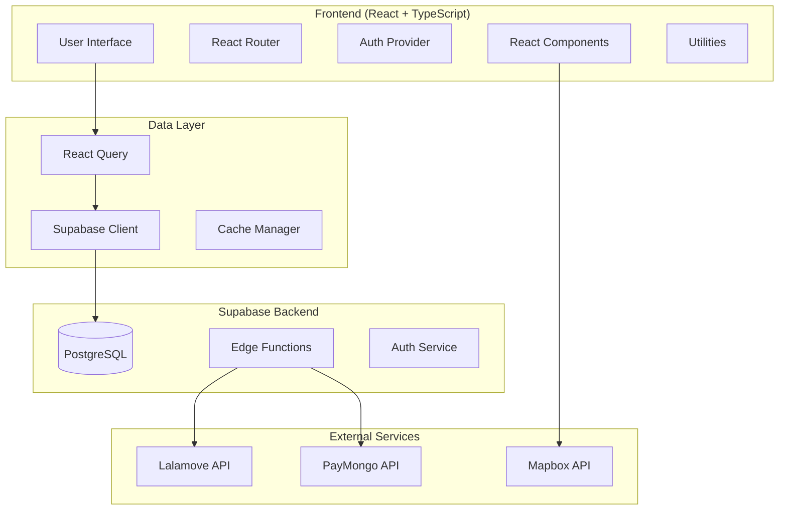
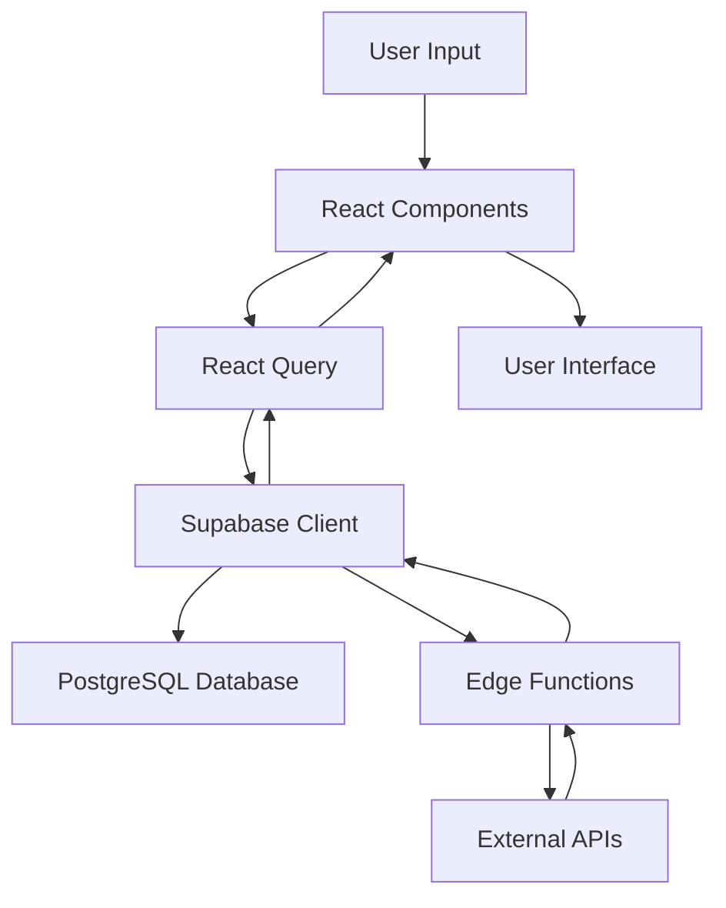

## Software Requirements Document (SRD)

---

## TABLE OF CONTENTS

1. Document Overview
   - 1.1 Scope
   - 1.2 Audience

2. Project Overview
   - 2.1 Executive Summary
     - 2.1.1 Objectives
       - 2.1.1.1 Business Goals
       - 2.1.1.2 Technical Goals
       - 2.1.1.3 High-Level Features
   - 2.2 Problem Statement
     - 2.2.1 User Needs
     - 2.2.2 Market Analysis Summary

3. Functional Specifications
   - 3.1 Feature List
     - 3.1.1 Detailed Descriptions
   - 3.2 User Stories & Requirements
     - 3.2.1 User Stories
     - 3.2.2 Acceptance Criteria
     - 3.2.3 Non-functional Requirements

4. Technical Specifications
   - 4.1 Architecture
     - 4.1.1 Overview Diagram
     - 4.1.2 Design Patterns
   - 4.2 Platform-Specific Considerations
     - 4.2.1 Web Application Guidelines
     - 4.2.2 Hardware & OS Compatibility
   - 4.3 Data Management
     - 4.3.1 Data Flow Diagram
     - 4.3.2 Database Schemas
     - 4.3.3 API Endpoints
   - 4.4 Security & Privacy
   - 4.5 Third-Party Integration

5. UI/UX Design Specifications
   - 5.1 Wireframes & Mockups
   - 5.2 Navigation & Flow
     - 5.2.1 User Flow Diagrams
     - 5.2.2 Accessibility Guidelines

6. Deployment & Maintenance
   - 6.1 Deployment Plan
     - 6.1.1 Release Process
     - 6.1.2 Rollout Strategy

---

## 1. Document Overview

### 1.1 Scope
This document outlines the complete software requirements for the **Cyber Route Flow** logistics and distribution platform, version 1.2.1. It covers functional specifications, technical architecture, UI/UX design, and deployment strategies for a comprehensive logistics management system.

### 1.2 Audience
- **Primary**: Development Team, Technical Architects, Product Managers
- **Secondary**: Business Stakeholders, QA Engineers, DevOps Engineers
- **Tertiary**: End Users (Logistics Managers, Fleet Operators, Customer Service Representatives)

---

## 2. Project Overview

### 2.1 Executive Summary
Cyber Route Flow is a modern, web-based logistics and distribution platform designed to streamline the entire supply chain process from order management to final delivery confirmation.

#### 2.1.1 Objectives

##### 2.1.1.1 Business Goals
- **Operational Efficiency**: Reduce delivery time by 30% through optimized route planning
- **Cost Reduction**: Minimize transportation costs via intelligent 3PL provider selection
- **Customer Satisfaction**: Achieve 95% on-time delivery rate with real-time tracking
- **Scalability**: Support growing business volumes without proportional cost increases
- **Compliance**: Ensure regulatory compliance for shipping documentation

##### 2.1.1.2 Technical Goals
- **Performance**: Sub-2 second page load times with 99.9% uptime
- **Scalability**: Handle 10,000+ concurrent users with auto-scaling capabilities
- **Security**: SOC 2 Type II compliance with end-to-end encryption
- **Integration**: Seamless API connectivity with external logistics providers
- **Maintainability**: Clean, documented codebase with 80%+ test coverage

##### 2.1.1.3 High-Level Features
- **Shipment Management**: Create, track, and manage shipments end-to-end
- **Route Optimization**: AI-powered delivery route planning and optimization
- **Real-time Tracking**: GPS-based tracking with customer notifications
- **Document Generation**: Automated creation of shipping documents and POD
- **Analytics Dashboard**: Performance metrics and business intelligence
- **Mobile Responsiveness**: Full functionality across all device types

### 2.2 Problem Statement

#### 2.2.1 User Needs
- **Logistics Managers**: Need centralized visibility into all shipments and operations
- **Fleet Operators**: Require optimized routes and real-time communication tools
- **Customer Service**: Need access to real-time shipment status for customer inquiries
- **Business Owners**: Require analytics and reporting for operational decisions
- **End Customers**: Want transparent tracking and timely delivery notifications

#### 2.2.2 Market Analysis Summary
The global logistics software market is valued at $14.8 billion (2023) with 12.3% CAGR. Key drivers include:
- E-commerce growth demanding faster, more efficient delivery
- Rising fuel costs requiring route optimization
- Customer expectations for real-time visibility
- Need for integrated, cloud-based solutions

---

## 3. Functional Specifications

### 3.1 Feature List

#### 3.1.1 Detailed Descriptions

**Core Logistics Features:**
1. **Shipment Management System**
   - Create and manage shipment records
   - Assign carriers (internal fleet or 3PL providers)
   - Track shipment status throughout lifecycle
   - Generate shipping labels and documentation

2. **Route Planning and Optimization**
   - Geography-based route optimization using [Mapbox API](https://docs.mapbox.com/)
   - Dynamic route adjustments based on traffic and weather
   - Multi-stop delivery planning with priority ordering
   - Fuel cost and time estimation

3. **Real-time Tracking and Monitoring**
   - GPS-based vehicle tracking integration
   - Customer notification system for delivery updates
   - Exception handling for delays or issues
   - Proof of delivery capture with electronic signatures

4. **Third-Party Logistics Integration**
   - [Lalamove API](https://developers.lalamove.com/) integration for on-demand delivery
   - Multi-carrier rate comparison and selection
   - Automated shipment assignment based on cost and service requirements
   - Real-time status synchronization with 3PL providers

5. **Document Management**
   - Automated generation of packing slips, bills of lading, and invoices
   - Customizable document templates using PDF generation utilities
   - Digital document storage and retrieval
   - Regulatory compliance for international shipping

### 3.2 User Stories & Requirements

#### 3.2.1 User Stories

**As a Logistics Manager:**
- I want to view all active shipments on a dashboard so I can monitor operations
- I want to assign shipments to the most cost-effective carrier automatically
- I want to receive alerts for delayed or problematic shipments

**As a Fleet Operator:**
- I want optimized routes for my delivery schedule to minimize fuel costs
- I want real-time updates when routes need to be adjusted
- I want to capture proof of delivery electronically

**As a Customer Service Representative:**
- I want access to real-time shipment tracking information
- I want to send proactive notifications to customers about delivery status
- I want to handle customer inquiries efficiently with complete shipment history

#### 3.2.2 Acceptance Criteria

**Shipment Creation:**
- ✅ User can create shipment with origin, destination, and cargo details
- ✅ System validates addresses using geocoding API
- ✅ System assigns tracking number automatically
- ✅ User receives confirmation with tracking details

**Route Optimization:**
- ✅ System calculates optimal route within 5 seconds
- ✅ Route considers traffic, distance, and delivery time windows
- ✅ System provides alternative routes when primary route is blocked
- ✅ Fuel cost estimation accuracy within 10% of actual cost

#### 3.2.3 Non-functional Requirements

**Performance Requirements:**
- Page load times: < 2 seconds for 95% of requests
- API response times: < 500ms for data queries
- System availability: 99.9% uptime (8.76 hours downtime/year)
- Concurrent users: Support 10,000+ simultaneous users

**Security Requirements:**
- Data encryption: AES-256 for data at rest, TLS 1.3 for data in transit
- Authentication: Multi-factor authentication for admin users
- API security: Rate limiting and OAuth 2.0 token-based authentication
- Audit logging: Complete audit trail for all user actions

---

## 4. Technical Specifications

### 4.1 Architecture

#### 4.1.1 Overview Diagram
*Reference: Software Architecture Diagram*

#### 4.1.2 Design Patterns

**Frontend Patterns:**
- **Component-Based Architecture**: Reusable React components with TypeScript
- **Provider Pattern**: Context-based state management for authentication
- **Hook Pattern**: Custom hooks for data fetching and business logic
- **Observer Pattern**: React Query for cache management and data synchronization

**Backend Patterns:**
- **API Gateway Pattern**: Supabase Edge Functions as API gateway
- **Repository Pattern**: Database abstraction layer
- **Strategy Pattern**: Multiple payment and shipping provider integration
- **Command Pattern**: Asynchronous job processing for background tasks

### 4.2 Platform-Specific Considerations

#### 4.2.1 Web Application Guidelines
- **Progressive Web App (PWA)**: Offline capability for critical features
- **Responsive Design**: Mobile-first approach with Tailwind CSS
- **Browser Compatibility**: Support for Chrome 90+, Firefox 88+, Safari 14+, Edge 90+
- **Performance Optimization**: Code splitting, lazy loading, and CDN usage

#### 4.2.2 Hardware & OS Compatibility
- **Minimum System Requirements**: 4GB RAM, modern dual-core processor
- **Network Requirements**: Stable internet connection (minimum 1 Mbps)
- **Mobile Devices**: iOS 13+, Android 8+
- **Desktop OS**: Windows 10+, macOS 10.15+, Ubuntu 18.04+

### 4.3 Data Management

#### 4.3.1 Data Flow Diagram

#### 4.3.2 Database Schemas
*Reference: Supabase Types*

**Core Tables:**
- `shipments`: Shipment records with status, origin, destination
- `customers`: Customer information, credit limits, preferences
- `profiles`: User profiles and authentication data
- `proof_of_delivery`: Digital POD records with signatures
- `routes`: Optimized route data and waypoints

#### 4.3.3 API Endpoints
**Supabase Edge Functions:**
- `/shipping`: Lalamove integration
- `/payment-gateway`: PayMongo integration
- `/map-token`: Mapbox token management

### 4.4 Security & Privacy
- **Data Protection**: GDPR and CCPA compliance
- **Access Control**: Role-based permissions (Admin, Manager, Operator, Viewer)
- **API Security**: Rate limiting, input validation, SQL injection prevention
- **Privacy**: Data anonymization for analytics, opt-out mechanisms

### 4.5 Third-Party Integration

**Shipping APIs:**
- **Lalamove**: On-demand delivery and logistics services
- **Custom 3PL**: Integration framework for additional carriers

**Payment Processing:**
- **PayMongo**: Credit card and digital wallet processing
- **Extensible**: Framework for additional payment providers

**Mapping and Geocoding:**
- **Mapbox**: Interactive maps, route planning, geocoding services
- **GPS Tracking**: Integration with fleet management systems

---

## 5. UI/UX Design Specifications

### 5.1 Wireframes & Mockups
**Design Theme**: Futuristic cyber aesthetic with neon green (#39FF14) accents
- **Color Palette**: Dark backgrounds with translucent glass effects
- **Typography**: Modern, clean fonts with high contrast
- **Components**: shadcn/ui component library
- **Styling**: Tailwind CSS utility-first approach

### 5.2 Navigation & Flow

#### 5.2.1 User Flow Diagrams
**Primary User Flows:**
1. **Shipment Creation Flow**: Login → Dashboard → Create Shipment → Assign Carrier → Confirm
2. **Tracking Flow**: Search → View Details → Real-time Updates → POD Confirmation
3. **Route Planning Flow**: View Routes → Optimize → Assign to Driver → Monitor Progress

#### 5.2.2 Accessibility Guidelines
- **WCAG 2.1 AA Compliance**: Screen reader support, keyboard navigation
- **Color Contrast**: Minimum 4.5:1 ratio for normal text
- **Font Sizing**: Scalable text up to 200% without loss of functionality
- **Focus Indicators**: Clear visual focus states for all interactive elements

---

## 6. Deployment & Maintenance

### 6.1 Deployment Plan

#### 6.1.1 Release Process
**CI/CD Pipeline:**
1. **Development**: Feature branches with pull request reviews
2. **Testing**: Automated testing with 80%+ code coverage
3. **Staging**: Vercel preview deployments for testing
4. **Production**: Automated deployment to [Vercel](https://vercel.com) upon merge

**Build Process:**
- **Build Tool**: Vite for optimized production builds
- **Package Manager**: Bun for fast dependency management
- **Code Quality**: ESLint and TypeScript strict mode

#### 6.1.2 Rollout Strategy
**Phased Deployment:**
1. **Alpha Release**: Internal testing (Development team)
2. **Beta Release**: Limited user group (Key customers)
3. **Production Release**: Full rollout with monitoring
4. **Post-Release**: Performance monitoring and hot-fix capability

**Monitoring and Maintenance:**
- **Performance Monitoring**: Real-time application performance monitoring
- **Error Tracking**: Automated error reporting and alerting
- **Database Maintenance**: Automated backups and optimization
- **Security Updates**: Regular dependency updates and security patches

---

**Document Version**: 1.2.1  
**Last Updated**: December 2024  
**Next Review**: March 2025